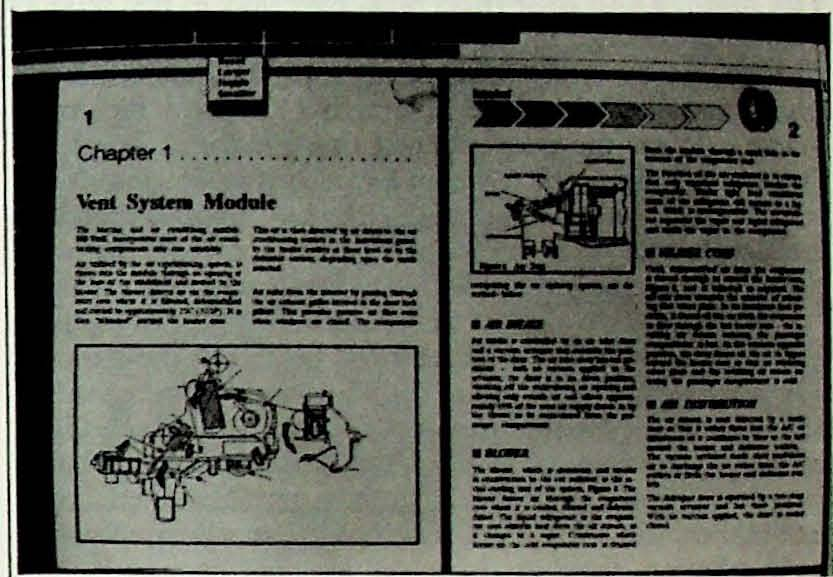
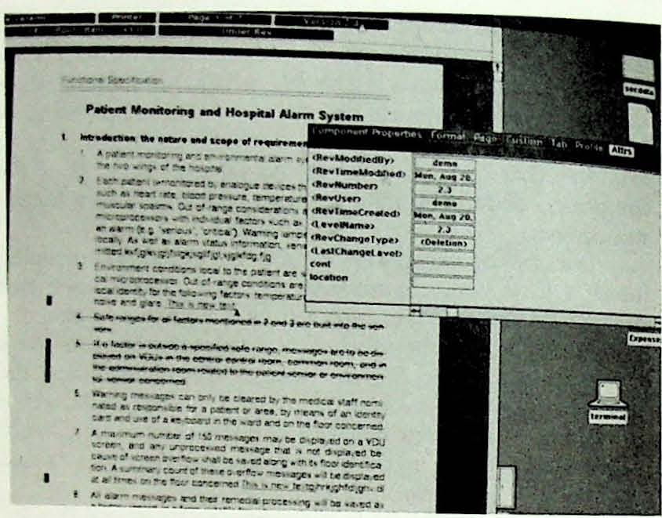
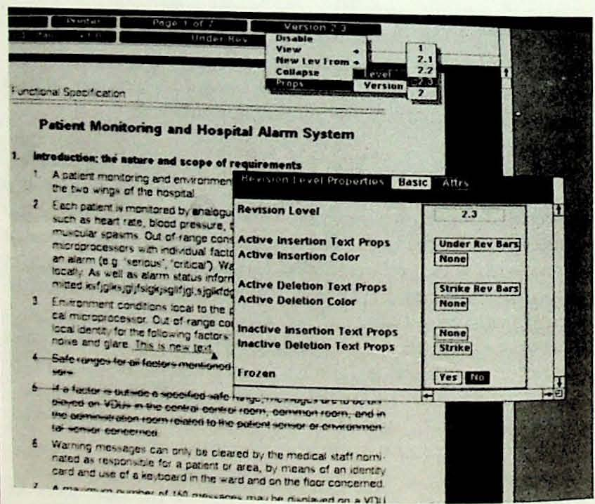
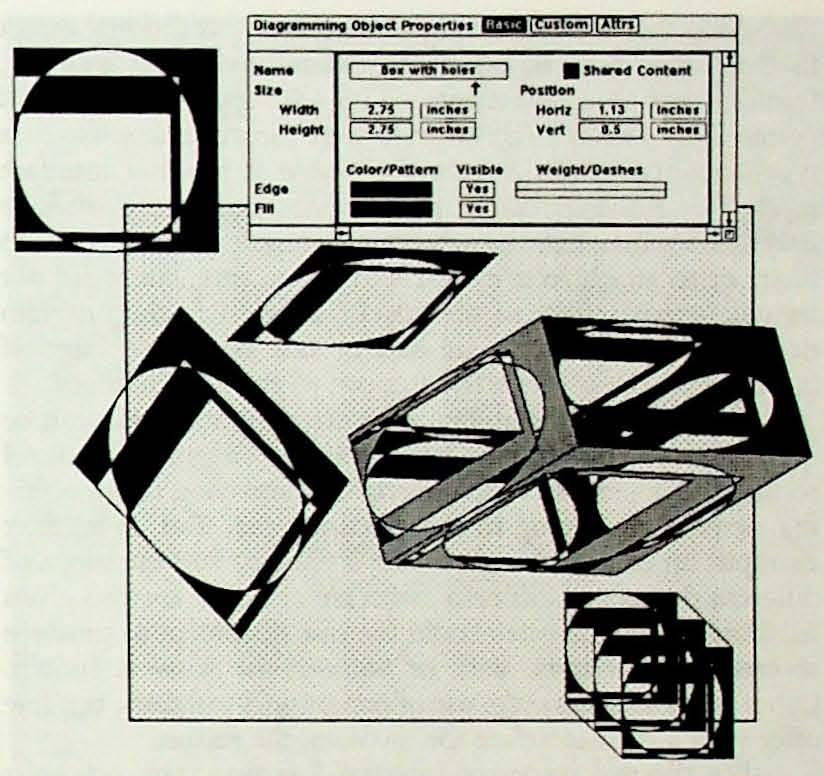
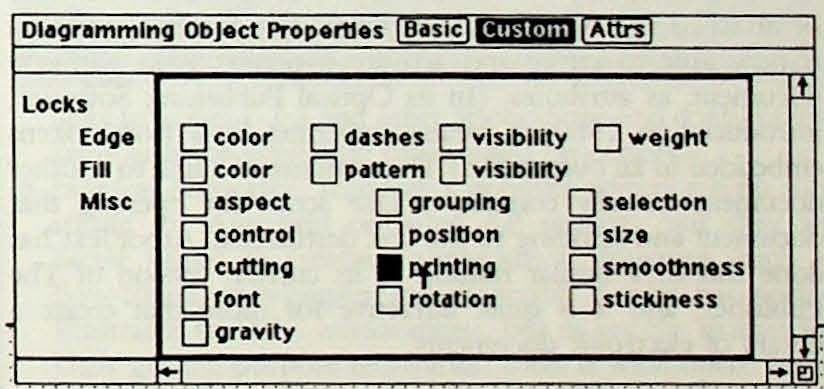
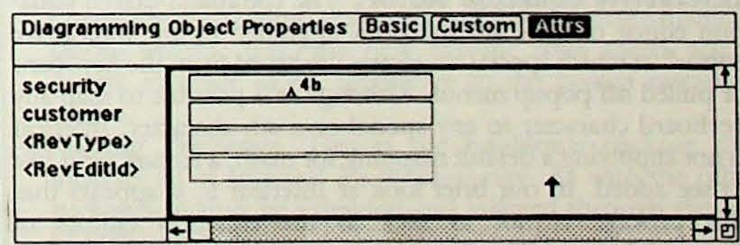
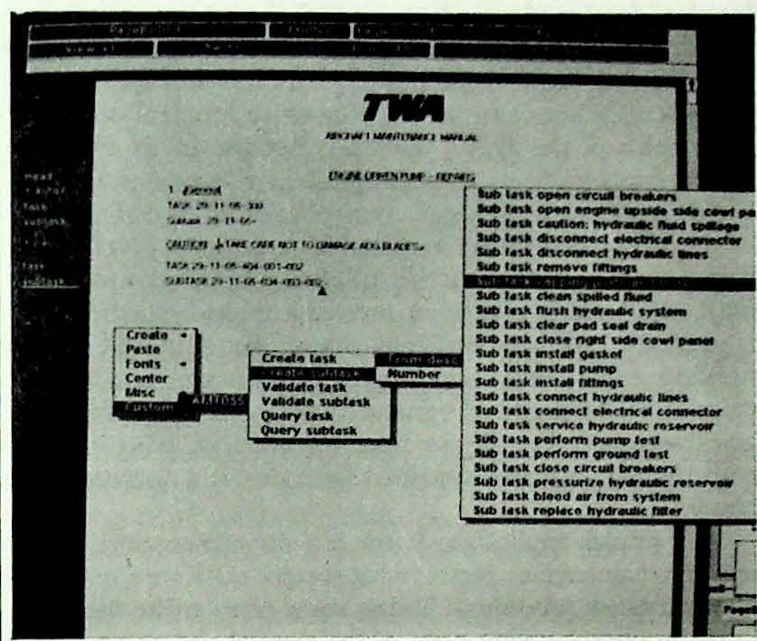
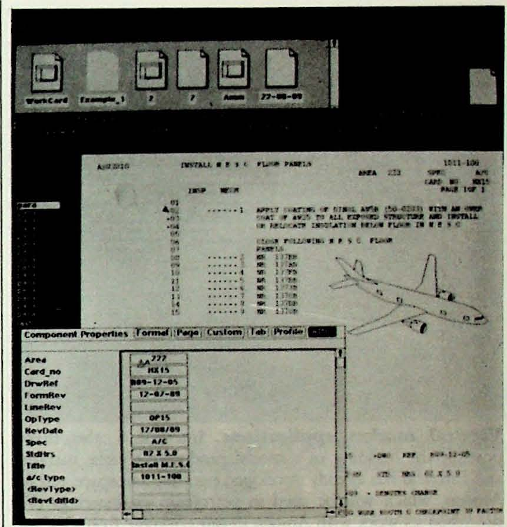
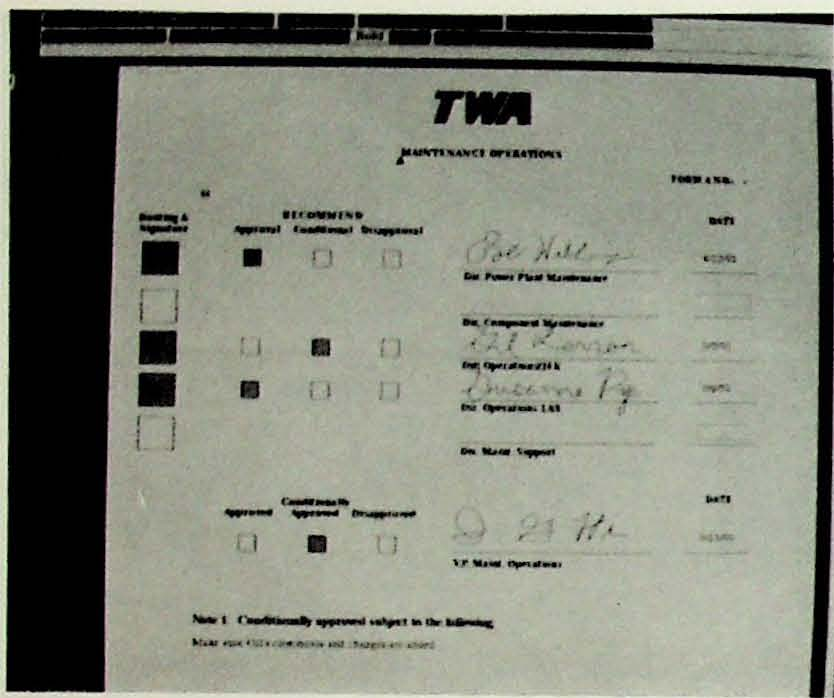
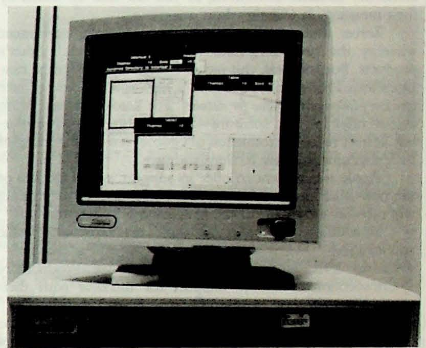

Отчет Сейболда о системах публикации,\
том 20, номер 3\
8 октября 1990 г.

# Interleaf 5: Полная переработка TPS

*В этой статье представлен обзор анонса компанией Interleaf новой технологии Interleaf 5, сделанного 3 октября на конференции Seybold Computer Publishing Conference. Хотя она во многом похожа на TPS, Interleaf 5 представляет собой радикальное изменение для компании. Вместо простого добавления функций к TPS, Interleaf разобрала её и создала набор программируемых модулей, которые могут быть связаны между собой различными способами и доступны пользователям или другим поставщикам. Центральным компонентом всех модулей является возможность настройки любого аспекта системы — даже программирования документа для выполнения определённых действий без вмешательства оператора, что Interleaf называет «активными документами». Кроме того, несколько ключевых изменений в базовом механизме компоновки позволят Interleaf привести своё программное обеспечение в соответствие с современными операционными средами. Для своевременной публикации информации мы подготовили этот материал заранее, основываясь на посещении конференции Interleaf.*

Программное обеспечение для технической публикации (TPS) компании INTERLEAF на протяжении нескольких лет было ведущим программным обеспечением для публикации на рабочих станциях Unix, но за последний год или около того позиции компании ослабли. Ее настольные программы — Interleaf Publisher для ПК и Macintosh — продавались медленно и не обеспечили Interleaf прочное место на массовом рынке, как она надеялась. В то же время компания переживает сложный переход от продажи готовых систем, которые когда-то были ее основным бизнесом, к продаже только программного обеспечения и услуг, таких как консалтинг, обучение и поддержка.

Компания Interleaf столкнулась с рядом проблем. Во-первых, уникальное сочетание быстрого текстового редактора WYSIWYG и превосходных графических редакторов перестало быть достаточным конкурентным преимуществом на рынке. Продажи программного обеспечения для рабочих станций оставались высокими, но конкуренция на рынках ПК и Mac предвещала рост конкуренции на рынке Unix. По мере того, как FrameMaker, Ventura и другие конкуренты развивались, начиная с бюджетного сегмента, Interleaf нуждалась в продукте, который сразу же воспринимался бы как более совершенный, чем у конкурентов. В то же время, его расширенные функции должны были быть ценными для клиентов.

Ещё одной проблемой, с которой столкнулась компания Interleaf, был пользовательский интерфейс. Созданный ею в начале 1980-х годов — до того, как графические пользовательские интерфейсы стали общедоступными для компьютеров — рабочий стол стал недостатком на общем рынке программного обеспечения, где от приложений теперь ожидается соответствие графическому пользовательскому интерфейсу, предоставляемому производителем компьютера. Таким образом, одновременно с необходимостью в совершенстве, Interleaf требовался продукт, который с точки зрения пользователей был бы согласовыван с другими приложениями, которые они могли бы запускать на своих компьютерах.

Решением компании Interleaf стало разделение большей части своего продукта TPS на отдельные компоненты и создание инструментария, на основе которого можно разрабатывать программные приложения. Этот инструментарий соответствует видению Interleaf своей роли в отрасли — компания должна расширять спектр своих услуг, одновременно сосредотачиваясь на решении конкретных отраслевых и клиентских проблем. Инструментарий также позволит Interleaf предлагать единый базовый уровень программного обеспечения на всех своих платформах и, начиная со следующего года, предлагать продукты, совместимые с другими графическими пользовательскими интерфейсами.

------------------------------------------------------------------------

**Interleaf 5 в среде OpenWindows.** Новое программное обеспечение Interleaf во многом похоже на TPS, но ключевые изменения были внесены под поверхностью. Здесь оно работает внутри оконной технологии Sun на основе X, OpenWindows, хотя пока не использует пользовательский интерфейс Open Look.

------------------------------------------------------------------------

Одной из отличительных черт Interleaf 5 является поддержка «активных документов». При перестройке своего программного обеспечения Interleaf сделала каждый компонент документа, как текстовый, так и графический, объектом, который может иметь программируемые атрибуты. Мы писали о концепции активных документов Interleaf, когда она была представлена на семинарах Seybold в марте прошлого года *(см. том 19, № 14).* С появлением Interleaf 5 эта функция теперь реализована в продукте.

В некотором смысле, Interleaf 5 — это седьмой крупный релиз Interleaf для TPS за восемь лет. С этой точки зрения, Interleaf 5 — это TPS 5.0 — TPS в том виде, в котором мы его знаем, с добавлением некоторых расширений в программировании.

На первый взгляд, Interleaf 5 мало чем отличается от TPS 4.0. Но более внимательное изучение выявляет фундаментальные, основополагающие различия в новом коде. По словам Стива Пеллетье, главного технического директора Interleaf, в этом релизе внутренняя структура TPS была переработана больше, чем в любом другом. Значительные изменения коснулись трех основных областей:

- **Модульная архитектура.** Компания Interleaf называет Interleaf 5 открытой архитектурой, но «открытая» означает многое для разных людей. В Interleaf 5 архитектура представляет собой модульную систему, программируемую на каждом уровне, что позволяет ей работать на различных аппаратных и программных платформах и тесно взаимодействовать со многими прикладными программами. Это первый продукт для издательской деятельности, разработанный для интеграции специфических функций издательской деятельности с другими приложениями, управляемыми на основе модели документа. И это один из немногих продуктов на рынке, предлагающих встроенный язык и интерпретатор для прикрепления скриптов к объектам внутри документа или документам в целом. Другие программы расширяемы, но немногие, если вообще какие-либо, предлагают такую широту программируемости, как Interleaf 5.
- **Архитектура шрифтов.** Компания Interleaf отказалась от своего подхода к растровым шрифтам в пользу технологии на основе контуров, которая будет частью всех продуктов на базе Interleaf 5. Первоначально она использует Speedo от Bitstream, но предусмотрела поддержку и других технологий контурирования шрифтов. Контурирование позволяет произвольно изменять размер шрифтов и их отображение на экране.
- **Оконный интерфейс/пользовательский интерфейс.** Переработка пользовательского интерфейса, пожалуй, самая сложная задача, поэтому она не была завершена к выставке. Interleaf всегда полагался на собственный оконный менеджер — даже при работе в другой графической оконной среде. Теперь он разрывает связь между движком и дисплеем, максимально используя внешнее системное программное обеспечение для оконных функций. В своей первоначальной версии Interleaf 5 представлял собой приложение X, работающее поверх X Window с интерфейсом TPS. К следующему году Interleaf позволит вызывать один из нескольких пользовательских интерфейсов из одного и того же движка, что позволит представить продукты Motif, Open Look и Macintosh interface в 1991 году, а Presentation Manager — в 1992 году.

С точки зрения аппаратного обеспечения, движок Interleaf 5 предлагается для рабочих станций Sun, DEC, IBM, Apollo и HP под управлением Unix, IBM-совместимых ПК под управлением MS-DOS и Apple Macintosh. Однако расширения LISP, которые настраивают движок и документы в соответствии с требованиями пользователя, необходимо писать только один раз, поскольку интерпретатор LISP, поставляемый в составе движка, одинаков для всех платформ.

----

> [!NOTE]
> Движок Interleaf состоит из отдельных объектов, которые можно объединять и расширять с помощью языка LISP.

----

**Выход на новую территорию.** Масштабные изменения в этих областях привели к созданию принципиально нового продукта для Interleaf — отсюда и его новое название. Но Interleaf 5 тесно связан с TPS 4.0, поэтому Interleaf сохранил число 5. Рассмотрев его, мы видим Interleaf 5 как продукт нового класса для издательской деятельности. Частично движок, частично среда разработки, частично пакет для конечных пользователей — в целом, мы можем описать его только как активную среду для работы с документами, на основе которой разрабатывается семейство продуктов для решения общих задач в горизонтальной области и конкретных задач в вертикальной области рынка.

Да, Interleaf по-прежнему может предлагать готовый продукт, ориентированный на массовую аудиторию. И на конференции компания представит несколько таких пакетов. Но мы считаем гораздо более вероятным, что первоначальный спрос на продукт возникнет у крупных корпоративных издателей, ищущих системы, которые делают больше, чем просто размещают текст и графику на страницах. В конечном итоге, по мере того, как VAR-партнеры и даже конечные пользователи привыкнут к созданию активных документов и

Компания Interleaf, специализирующаяся на программном обеспечении для персонализированной публикации, может выйти на массовый рынок с продуктом на базе Interleaf 5. Внешний вид и функциональность версий для ПК и Macintosh, выход которых запланирован на следующий год, будут иметь решающее значение для успеха на массовом рынке.

На данный момент мы рассматриваем Interleaf 5 как универсальный инструментарий, на основе которого Interleaf, другие разработчики, VAR-партнеры и опытные конечные пользователи будут создавать инструменты управления информацией. Он почти как менеджер баз данных: поставщик предоставляет конечным пользователям базовое программное обеспечение, на основе которого могут быть созданы другие приложения, а затем предлагает в качестве услуги решения, разработанные на заказ.

В отличие от большинства программ для издательской деятельности, Interleaf 5 обладает потенциалом для тесного взаимодействия с другими приложениями. Под этим мы подразумеваем нечто большее, чем просто фильтры, позволяющие копировать и вставлять текст между документами, или динамические ссылки, которые автоматически подгружают информацию. В последнее время на рынке высококлассных программ наблюдается тенденция к разработке инструментов для издательской деятельности, которые напрямую взаимодействуют с базами данных, что открывает новые горизонты для понятия электронной публикации.

Если бы Interleaf был новинкой на рынке, мы, вероятно, начали бы с описания основного движка Interleaf 5. Но теперь мы предполагаем, что большинство наших читателей хотя бы поверхностно знакомы с Interleaf TPS. По сути, движок содержит весь функциональный код TPS; теперь он просто построен по-другому. Мы подробно обсудим его новую базовую структуру, затем дадим обзор новых функций, расскажем, как он может выглядеть для конечного пользователя, и обсудим, как он упаковывается, продается и продвигается.

## **Конструкция Interleaf 5**

**Модульная архитектура.** В основе Interleaf 5 лежит модульная структура, написанная на языке C. Как и в предыдущих продуктах Interleaf, эти модули максимально оптимизированы для повышения производительности, не будучи привязанными к конкретным операционным системам или оборудованию. Но в отличие от предыдущих версий, структура Interleaf 5 состоит из отдельных объектов, которые могут быть объединены и расширены с помощью языка программирования LISP, используемого в Interleaf. Если раньше код для активации и отображения функций структуры (h&j, пагинация, графика и т. д.) также писался на C и был тесно связан с структурой, то в Interleaf 5 код, активирующий структуру, написан на LISP. По сути, все компоненты структуры, которые ранее были очень разными, объединены в программируемые объекты. Каждый компонент структуры (объект) имеет свой собственный класс и может обладать уникальным поведением, но тот факт, что все они являются подмножествами основного класса объектов, позволяет программировать действия, влияющие на все уровни системы.

Фактически, все объекты движка теперь рассматриваются как объекты LISP. Interleaf предоставляет интерпретатор LISP в составе каждого продукта на основе Interleaf 5. Ключевое отличие между тем, что Interleaf сделал с Interleaf 5, и тем, что Quark сделал с Xpress, заключается в том, что расширения, написанные для Interleaf 5, не привязываются к исходному коду. Расширения LISP воздействуют на объекты внутри системы, не зная, какой код лежит в их основе.

Компоненты движка — h&j, пагинация, несколько графических редакторов, ресурсы шрифтов, переводчики и т. д. — функционально не сильно отличаются от того, что доступно в TPS 4.0, хотя и есть новые функции. Interleaf решил большинство проблем, связанных с объединением текста и графики на странице, и сделал это чрезвычайно быстро и гибко. Таким образом, все известные функции редактора составных документов по-прежнему присутствуют.

Однако, разделив движок на *доступные* модули, Interleaf теперь позволяет вставлять внешний код, который выполняется при входе в один из этих модулей или выходе из него.

Например, один сторонний разработчик работает над модулем переноса слов для Interleaf 5. Он будет интегрироваться в систему на уровне движка, так что пользователь не увидит разницы в поведении системы, но композиция может получиться более качественной в новом модуле, использующем ранжированные предпочтительные точки переноса.

Можно также разработать другие расширения для создания редактора, настраиваемого пользователем, — будь то структурированный редактор, который позволяет автору придерживаться заранее определенной структуры и стиля, полнофункциональный редактор составных документов с любимыми сочетаниями клавиш или обработчик форм, в котором документ используется в качестве интерфейса для доступа к базе данных.

**Отлично! Но — LISP?** Хотя возможность расширять систему и определять новые атрибуты объектов, написав собственный код, является мощной функцией, мы задаемся вопросом, насколько комфортно будет конечным пользователям работать с LISP. Язык имеет довольно своеобразный синтаксис, с которым знакомо сравнительно мало программистов (и еще меньше непрограммистов). Он резко контрастирует со скриптовыми языками, такими как те, что используются в HyperCard или Excel, которые были разработаны для программирования конечными пользователями. (Некоторые циники даже задавались вопросом, не была ли истинная цель Interleaf при выборе LISP обеспечение себе большого количества заказов на разработку программного обеспечения на заказ.) Мы подозреваем, что пользователи столкнутся с некоторыми трудностями при освоении новых функций.

**Ресурсы шрифтов.** Все предыдущие версии программного обеспечения Interleaf были основаны на растровой модели шрифтов, которая обеспечивала чрезвычайно быстрое отображение, но создавала нагрузку на дисковое пространство и ограничивала большинство своих версий дискретными размерами шрифтов. В Interleaf 5 Interleaf перешла на технологию, основанную на контурах, что добавляет новые функции и уменьшает объем занимаемого программой дискового пространства.

Первоначально шрифт Speedo от Bitstream будет встроен во все версии Interleaf 5. Набор шрифтов PostScript LaserWriter Plus является стандартным набором шрифтов для всех продуктов Interleaf 5, но все они также будут поддерживать любые дополнительные шрифты Bitstream, которые пользователь может приобрести.

Программное обеспечение поддерживает произвольное изменение размера шрифтов с точностью до десятых долей пункта в диапазоне от 4 до 400 пунктов. Кроме того, отображение любого документа может быть увеличено или уменьшено в процентах в диапазоне от 25% до 1600% от его исходного размера.

Впервые Interleaf предложит отображение разворотов страниц. Если уменьшить масштаб страницы, на экране одновременно может отображаться до восьми страниц в размере чуть больше, чем в миниатюре. Независимо от размера, документ остается полностью редактируемым, и текст никогда не «зачеркивается», даже если его размер делает его практически нечитаемым.

------------------------------------------------------------------------

**Двухстраничный режим отображения.** Используя технологию Speedo от Bitstream, Interleaf 5 масштабирует отображение страницы до произвольных размеров.

------------------------------------------------------------------------

В демонстрационных примерах, которые мы видели, увеличение или уменьшение масштаба приводило к значительному снижению производительности, поскольку шрифт растрировался. После того, как шрифт оказывался в оперативной памяти, использование шрифта такого размера происходило довольно быстро.

Одним из недостатков является то, что из-за невозможности отображения более двух страниц в горизонтальном ряду технология отображения приводит к тому, что в режиме просмотра миниатюр все страницы располагаются в левой части окна, оставляя часть правой стороны пустой. Если бы Interleaf мог отображать больше страниц по горизонтали, в режиме просмотра миниатюр можно было бы показывать до 16 страниц одновременно.

Ещё одно ограничение заключается в том, что страницы должны быть смежными. Например, невозможно отобразить страницы 1 и 16 рядом друг с другом.

Важно отметить, что Interleaf планирует использовать шрифтовые ресурсы операционных систем, поддерживающих шрифты. Таким образом, компания планирует поддержку Adobe Type Manager, а также, возможно, поддержку других технологий контурной печати (TrueType, Folio), которые могут стать значимыми на рынке.

Почему бы не использовать менеджеры ресурсов шрифтов в X Window и других доступных сегодня средах Unix? Компания Interleaf решила, что вместо предоставления различных возможностей работы со шрифтами на разных платформах, она предложит единые возможности работы со шрифтами для всех своих продуктов на базе Interleaf 5. Использование Speedo на всех платформах позволит предоставлять драйверы для PostScript, Impress, IBM AFP, LeafScript и PCL 4, которые позволят пользователям Interleaf 5 печатать на любом устройстве, поддерживающем один из этих языков описания страниц, с полной уверенностью в том, что то, что было создано на экране, будет отображено на бумаге или пленке. При условии, что принтер поддерживает загружаемые шрифты, пользователю также не нужно беспокоиться о том, находятся ли выбранные шрифты в самом принтере.

Компания Interleaf не отказывается от поддержки пользователей устройств, не поддерживающих загружаемые шрифты. Поддержка наборных машин Triple-I, Compugraphic 8000 series и Monotype по-прежнему доступна в Interleaf 5.

**Дисплей и пользовательский интерфейс.** С момента выхода своего первого продукта (помните OPS?), визитной карточкой Interleaf стали культовые рабочие столы и всплывающие каскадные меню. Этот подход, представленный в 1983 году, последовал за Xerox Star, но предшествовал Apple Macintosh и новым графическим пользовательским интерфейсам: Windows, Open Look и Motif. Когда в 1987 году Interleaf представила свои продукты для Macintosh и PC Publisher, компания сознательно решила предложить своим клиентам настольные продукты, которые по внешнему виду и функциональности были бы идентичны продуктам на базе Unix.

Сегодня рынок изменился. Теперь общепринятым фактом является то, что графические пользовательские интерфейсы станут частью стандартной операционной системы, хотя в мире Unix по-прежнему существует как минимум два основных интерфейса (Motif и Open Look). Разработчики всех компьютерных приложений вынуждены адаптировать свои программы к этим графическим интерфейсам, иначе им грозит отторжение на рынке. Для разработчиков, которые все чаще предлагают свои продукты для нескольких компьютеров, адаптация интерфейса к каждой среде — задача нетривиальная, если только это не предусмотрено в базовом коде.

В ответ на это Interleaf полностью отделит от базовых компонентов движка отрисовку окон и пользовательский интерфейс. Мы говорим «отделит», потому что эта работа не будет завершена до 1991 года. В первом релизе Interleaf 5 будет использовать X Window для отображения окон, но не будет предлагать альтернативные пользовательские интерфейсы. Например, на конференции была продемонстрирована работа Interleaf 5 на новой платформе Sun OpenWindows, но не была показана поддержка Open Look, которая обещана на 1991 год. Это хороший пример того, как на первый взгляд Interleaf 5 очень похож на TPS, но под поверхностью произошли значительные изменения.

К следующему году Interleaf начнет использовать наборы инструментов для создания интерфейсов, предоставляемые производителями оборудования. Версии Interleaf 5 для Sun Open Look и OSF/Motif будут использовать эти наборы инструментов, а версия для Mac — Macintosh Toolbox от Apple. Таким образом, Interleaf получила возможность разработать продукт на основе Interleaf 5, соответствующий любым требованиям к графическому пользовательскому интерфейсу.

В этом отношении мало что отличается от того, что Frame делал несколько лет назад. Но Interleaf идёт ещё дальше. Поскольку интерфейсный слой Interleaf 5 представляет собой набор программируемых объектов, можно писать скрипты LISP, взаимодействующие с пользовательским интерфейсом *независимо от базового кода движка.* Реселлер или опытный пользователь может фактически настраивать пользовательский интерфейс продукта Interleaf 5 без лицензии на исходный код, подобно тому, как пользователи создают формы запросов к базам данных с помощью современных продуктов управления базами данных. Насколько нам известно, Interleaf — первый поставщик, представивший такой настраиваемый пользователем интерфейс для издательского продукта.

(Следует признать, что более вероятно, что Interleaf, VAR-партнер или системный администратор клиента выполнят эту настройку для конечных пользователей, а не они сами. В конце концов, это программирование на LISP, а не на HyperCard. Но в академической среде вполне разумно ожидать, что сообразительные конечные пользователи действительно внесут такие изменения самостоятельно.)

------------------------------------------------------------------------

**Отслеживание изменений.** Теперь это стандартная функция движка, отслеживающая изменения текста и графики; она отслеживает, кто внес изменения, когда и в какой версии документа. *Вверху:* Атрибуты в окне свойств компонента. *Внизу:* Стиль отслеживания изменений задается в окне свойств версии документа.

------------------------------------------------------------------------

Остается открытым вопрос о том, как процедуры LISP, написанные для одной среды, будут работать в другой (Mac Toolbox имеет функции, отличающиеся от инструментария Open Look). Interleaf изучает это взаимодействие, но мы узнаем, как будет решена эта проблема, только в следующем году. До тех пор один из вариантов — разместить часть пользовательского интерфейса непосредственно в документе. Например, горячие кнопки Interleaf — значки в документе, которые запускают действия (аналогичные кнопкам HyperCard) — переносимы на все платформы Interleaf 5 без дополнительного программирования.

## **Особенности Interleaf 5**

В дополнение к описанным выше фундаментальным изменениям, Interleaf добавила в свое основное программное обеспечение новый набор функций для публикации. Сначала мы опишем наиболее существенные изменения, а затем перечислим другие важные улучшения.

**Контроль версий.** В TPS 4.0 можно запустить трассировку редактирования для отслеживания различных версий документа, но отслеживаемая информация должна быть разработана пользователем или Interleaf. В Interleaf 5 контроль версий является базовым компонентом системы, который, будучи частью пакета, отображается в строке меню в верхней части документа с полным диалоговым окном, содержащим список всех возможных элементов для отслеживания.

С помощью окна свойств пользователь задает стиль трассировки различных типов правок — например, зачеркивание, подчеркивание, разные цвета или полосы изменений. В рамках одной версии можно проводить несколько сеансов редактирования, каждый из которых может иметь свой собственный стиль, что позволяет разным людям редактировать одну и ту же версию и различать правки друг друга.

Система автоматически отслеживает изменения текста *и* графики (добавления и удаления), кто внес изменения, когда, на какой системе и в какое время.

После утверждения правок сохраняется новая версия с использованием иерархической системы нумерации. Всплывающее меню позволяет пользователю в любое время получить доступ к любой версии, текущей или предыдущей.

Используя Relational Document Manager (RDM), продукт Interleaf на базе Oracle, можно было бы добавить дополнительные элементы управления, такие как ограничение доступа в зависимости от уровня версии. Interleaf не предлагает функцию Context, позволяющую произвольно отображать различные сеансы редактирования *(например,* правки Сары, но не Боба), если они не записаны как отдельные версии, но, как и Context, он хранит все версии как итерации одного и того же документа, а не как отдельные документы. Хранение нескольких версий как итераций одного и того же документа упрощает отслеживание истории изменений и экономит дисковое пространство.

В целом, новая система контроля версий Interleaf является одной из лучших, если не *лучшей*, на рынке. Ключевое отличие отслеживания версий в Interleaf 5 от Context, который гордится этой функцией, заключается в том, что Context хранит информацию о версиях *внутри документа.* В сложных приложениях Interleaf отслеживает версии в RDM *(вне документа, в базе данных Oracle).* Подход Context тесно интегрирован со стандартным продуктом, но поддерживает только определенные типы данных. Стандартная система контроля версий Interleaf может предлагать меньше возможностей, чем Context, но благодаря RDM она предлагает больше, поскольку расширяет базовый пакет, включая другие приложения и другие типы данных, созданные продуктами других поставщиков. Interleaf также отслеживает изменения внутри таблиц и графиков, а не просто хранит разные версии.

**Мастера графических объектов.** Еще одно долгожданное улучшение — добавление таблицы свойств для всех графических объектов, созданных внутри фреймов. В TPS 4.0 таблица свойств была только у самого фрейма. В Interleaf 5 каждый объект диаграммы может быть назван, и каждый объект или группа объектов внутри фрейма имеет свою собственную таблицу свойств. Именование объектов позволяет Interleaf интегрировать графику в текстовую модель, где каждый абзац имеет имя (то, что Interleaf называет компонентами, или то, что обычно известно как тег). Благодаря именованию объектов Interleaf может применять подход таблиц стилей как к графике, так и к тексту.

Например, можно создать рисунок, в котором один элемент повторяется несколько раз. Позже, при внесении изменений в один из этих элементов, можно автоматически обновить все остальные, чтобы отразить эти изменения, при этом сохранив возможности трансформаций, таких как растяжение, сдвиг или вращение *(см. фото).* Изменение может касаться стиля (заливки, цвета и т. д.) или содержимого (положение, вращение, добавление или удаление объектов и т. д.). Эта функция является мощным дополнением к уже и без того мощной системе создания иллюстраций.

------------------------------------------------------------------------

**Графические окна свойств.** Теперь объекты диаграммы могут быть именованы, и им могут быть присвоены соответствующие окна свойств, показанные в трех диалоговых окнах ниже. Благодаря совместному использованию содержимого с другим графическим объектом с тем же именем, содержимое *и* стиль объектов могут контролироваться через окна свойств основных объектов.

------------------------------------------------------------------------

----

> [!NOTE]
> Реальная сила Interleaf 5 заключается в том, что код LISP может быть прикреплен к объектам в качестве атрибута.

----

Как будто этого было недостаточно, есть еще один аспект именованных объектов, общий для всех объектов (текста, фреймов, страниц и документов). TPS 4.0 поддерживал использование «расширяемых объектов» — объектов с неизвестным типом данных, — но эта функция не была доступна на уровне пользовательского интерфейса. Эта функция позволяла, например, включать графику в документы Interleaf, для которых у Interleaf не было фильтра, или устанавливать уровни безопасности для документов, но не позволяла прикреплять скрипты к объектам. В Interleaf 5 программе все равно, являются ли атрибуты данными или кодом LISP, и Interleaf вывел атрибуты объектов на уровень пользовательского интерфейса.

Для пользователя возможность легко создавать атрибуты может быть весьма удобной. Очевидное применение — присвоение уровня безопасности объектам и последующее выборочное отображение или скрытие элементов в зависимости от их уровня безопасности. Но, в другом примере, преподаватель может создать тест с вопросами разной степени сложности, ответы на которые также имеют атрибуты. Преподаватель может использовать один документ для создания нескольких различных тестов, с отображением ответов или без них. Другие программы позволяют использовать условные переменные, но лишь немногие предлагают такой удобный интерфейс для вызова этой функции.

Но настоящая мощь Interleaf 5 заключается в том, что код LISP может быть прикреплен к объектам в качестве атрибута. Например, Interleaf теперь может создавать и активировать гипертекстовые ссылки внутри документа в качестве атрибутов. (В своем программном обеспечении для оптической публикации, представленном в 1989 году, оно создает гипертекстовые ссылки из токенов, встроенных в выходной файл.) Атрибут ссылки на другой документ фактически содержит скрипт LISP для открытия этого документа и прокрутки до места назначения ссылки. ArborText реализовал это аналогичным образом в своей текущей версии The Publisher, и это весьма привлекательно для тех, кто создает библиотеку электронных документов.

**Интерактивный редактор уравнений.** Редактор уравнений TPS 4.0, управляемый командами, был модернизирован до «интерактивного редактора», в котором специальные символы вводятся с клавиатуры или берутся из всплывающих меню. Хотя можно сопоставить любой символ клавиатуры с любым специальным или математическим символом, Interleaf не предоставляет сопоставления по умолчанию для математических символов, и мы хотели бы увидеть добавление этой функции. В нашем кратком обзоре Interleaf 5 видно, что этот пакет не так удобен, как редакторы уравнений FrameMaker и The Publisher, но, несомненно, он сделает Interleaf 5 более привлекательным инструментом для тех, кто много пишет математических формул.

**Другие функции.** Другие новые функции могут быть менее заметными, но некоторые из них имеют существенное значение:

- *«Вычисляемые компоненты».* Interleaf 5 будет генерировать контент внутри компонентов на основе других компонентов. Например, он может извлекать содержимое заголовков из основного текста и преобразовывать его в колонтитулы или стоп-коды.
- *Палитра Illustrator.* В некоторых пакетах Interleaf 5 будет представлена новая палитра инструментов рисования, которая устраняет необходимость использования всплывающих, каскадных меню для создания и манипулирования объектами. Хотя Interleaf и заложил в свои меню интеллектуальные функции, позволяющие всплывающим окнам автоматически переходить к нужному элементу, палитра работает гораздо быстрее и лучше соответствует интерфейсам других программ для работы с иллюстрациями. Как и большинство аспектов Interleaf 5, палитру можно настроить, добавив в неё собственные графические элементы.
- *Повторяющиеся заголовки колонок.* Теперь верхние и нижние колонтитулы могут отличаться как для колонок, так и для разворотов.
- *Многоканальная нумерация страниц.* Эта функция, разработанная специально для фармацевтического рынка, позволяет одному документу иметь более одного набора страниц.
- *Цветной вывод PostScript.* Функция плашечных цветов в TPS 4.0, которая позволяла создавать цветоделения, была расширена, чтобы обеспечить печать всех или некоторых слоев на цветных принтерах PostScript, таких как QMS ColorScript.
- *Внешние ссылки на изображения.* Теперь изображения можно включать по ссылке, не вставляя их в документ, что экономит место на диске и полезно, когда изображения созданы кем-то другим, а не автором.
- *Расширенные возможности поиска и замены.* Поиск и замена теперь чувствительны к регистру и имеют широкий набор символов-заменителей.
- *Поддержка создания контента.* Клавиатура полностью настраивается пользователем во всех продуктах на базе Interleaf 5, поэтому вы можете назначить свои любимые действия любой клавише по своему усмотрению. Функция макросов в Interleaf 5 позволяет разработчикам не только сохранять нажатия клавиш и щелчки мыши в комбинации клавиш, но и прикреплять скрипты к клавишам. XyWrite обладает аналогичной возможностью, и мы считаем это бесценной экономией времени.
- *Улучшен контроль переноса слов.* Теперь можно указать количество букв, которые могут предшествовать или следовать за дефисом. Минимальное количество букв в слове с дефисом остается неизменным и равно 5.
- *Улучшен контроль межстрочного интервала.* Межстрочный интервал может быть задан как расстояние между базовыми линиями, и вы можете вводить отрицательные значения межстрочного интервала. Как и прежде, межстрочный интервал измеряется в сотых долях пункта.

**Совместимость с другими версиями.** Каждый разработчик программного обеспечения предлагает какой-либо способ миграции для преобразования документов, созданных в старых версиях, в новые версии своего ПО, но зачастую они пренебрегают возможностью обратного преобразования. Мы рады, что Interleaf включил функцию «преобразовать в предыдущую версию», которая преобразует документы Interleaf 5 в формат TPS 4.0 или Interleaf Publisher (для Mac или ПК). Кроме того, при преобразовании документов из старых версий в новые пользователь может зафиксировать верстку, чтобы при открытии в Interleaf 5 документ сохранил точно те же символы конца строки и нумерацию страниц.

## **Упаковка продукта**

В отличие от предыдущих продуктов Interleaf, Interleaf 5 не является единым продуктом. Основная технология может быть представлена в различных вариантах, соответствующих разным требованиям. Interleaf выделяет три типа продуктов для конечных пользователей: горизонтальные приложения, ориентированные на широкий круг пользователей, подобно TPS или Interleaf Publisher; приложения для вертикальных рынков, представляющие собой универсальные пакеты, адаптированные к конкретным отраслям и приложениям; и приложения, разработанные специально для клиентов, например, для Grumman. Горизонтальные приложения будут продаваться в основном через отдел прямых продаж, при поддержке соглашений с производителями оборудования. Пакеты для вертикальных рынков будут предлагаться VAR-партнерами и отдельными специалистами по продажам Interleaf, прошедшими обучение по данному приложению. Продукты, разработанные специально для клиентов, продаются и разрабатываются подразделением системной интеграции Interleaf, которое в настоящее время является самым быстрорастущим подразделением компании. В соответствующих случаях Interleaf разрабатывает продукты для вертикальных рынков как ответвления от заказных работ.

------------------------------------------------------------------------

**Продукты для вертикальных рынков.** Это программное обеспечение Professional Writer, предназначенное для создания руководств по техническому обслуживанию самолетов. Меню редактора предварительно настроены с компонентами, соответствующими конкретному применению.

------------------------------------------------------------------------

**Горизонтальные приложения.** На конференции компания Interleaf представила шесть универсальных пакетов, созданных на основе Interleaf 5. Все они используют базовый движок TPS, но обладают различными возможностями, отражающими их основное назначение:

- *Passport.* Универсальный редактор составных документов, предназначенный для повседневного использования в офисе, Passport во многом похож на TPS, но с добавлением технологии активного документа и без некоторых расширенных функций (таблицы, уравнения, редактирование в оттенках серого, контроль версий и т. д.). Первоначально он будет предлагаться с пользовательским интерфейсом Interleaf. Более широкий успех может быть достигнут в следующем году, когда Interleaf представит версии Open Look и Motif, в результате чего этот продукт Interleaf 5 будет конкурировать с FrameMaker, который теперь доступен на более чем 20 различных рабочих станциях Unix. Passport будет лишен некоторых функций FrameMaker, но может предложить то, чего нет в Frame, например, графические и диаграммные возможности Interleaf.
- *Interleaf Engineer.* Аналогично Passport, этот пакет добавляет редакторы таблиц и уравнений, а также набор инструментов для работы с методами *(описано ниже).*
- *Профессиональный писатель.* В дополнение к функциям Passport, этот пакет предлагает отслеживание правок, дополнительную программу Houghton Mifflin Writer's Helper *(описанную ниже),* гипертекстовые ссылки, прямые ссылки на Lotus 1-2-3 и другие приложения, а также настраиваемые клавиатуры для эмуляции других текстовых процессоров.

------------------------------------------------------------------------

**Автоматизированные карточки задач.** Это еще один пример технологии активного документооборота в сочетании с реляционным менеджером баз данных Interleaf. На переднем плане — список атрибутов компонента карточки инструкции по выполнению работ — перечень инструкций по техническому обслуживанию самолета. Большая часть карточки заполняется автоматически путем привязки к базе данных информации о продукте.

------------------------------------------------------------------------

- *Interleaf Illustrator.* Графические редакторы Interleaf не заменяют системы Auto-trol или InterCAP, но они лучше подходят для создания нетехнических чертежей, таких как блок-схемы, видограммы и диаграммы. Компания Adobe портировала Illustrator на рабочие станции DEC, но рынок универсальных инструментов для иллюстраций в Unix пока еще открыт. Interleaf Illustrator — это Passport плюс все графические возможности Interleaf: рисование, обработка изображений в оттенках серого и линейных изображений, графический текст, новые таблицы стилей и интерфейс палитры в качестве альтернативы всплывающим каскадным меню.
- *Interleaf Production.* Это полноценный пакет, включающий в себя весь функционал Interleaf 5. Как и другие пакеты, он может быть расширен и адаптирован с помощью скриптов LISP.
- *Interleaf Academic.* Этот пакет, содержащий все компоненты Interleaf Production, а также набор методических материалов, предоставляется бесплатно аккредитованным колледжам и университетам в США и Канаде.

Все эти продукты могут быть расширены с помощью скриптов LISP. Клиенты, приобретающие продукт с инструментарием, получат полный доступ ко всем компонентам программного обеспечения. Те, кто приобретает подмножество движка, могут обновить его, чтобы получить доступ к большему функционалу.

Компания Interleaf ожидает, что все эти пакеты будут доступны к концу года. На момент подготовки этой статьи компания Interleaf еще завершала определение цен. Мы предполагаем, что они будут варьироваться от 2400 до 16 000 долларов, но фактические цифры будут опубликованы по мере их поступления.

------------------------------------------------------------------------

**В работе находятся активные документы.** Данный заказ на внесение изменений в техническое задание представляет собой документ Interleaf, но его поля связаны с базой данных. Установка флажка «Утвердить» автоматически добавляет оцифрованную подпись и дату. Принятие с условиями запрашивает у пользователя ввод примечаний к условиям.

------------------------------------------------------------------------

**Вертикальные рыночные приложения.** Interleaf 5 также позволяет создавать специализированные продукты для нишевых рынков, и Interleaf уже разработала продукты для аэрокосмической отрасли и для Amoco, которые будут использоваться в нефтедобыче. (Мы описывали ее работу с Amoco в нашем материале с Seybold Seminars, том 19, № 14.) В дополнение к этим рынкам, Interleaf объявила о своем намерении разрабатывать вертикальные приложения для фармацевтической промышленности, автоматизированного проектирования программного обеспечения (CASE) и автомобильной промышленности.

Из всех этих рынков наибольшее внимание привлекает аэрокосмический рынок. Компания Interleaf создала бизнес-подразделение под руководством Ларри Бона, специально предназначенное для выполнения контрактов, требующих соблюдения требований Ассоциации воздушного транспорта (ATA, авиакомпании) и Ассоциации аэрокосмической промышленности (AIA, производители). За шесть месяцев численность подразделения выросла до 22 человек, и это не только в ожидании заказов. Interleaf уже получила контракты от America West, Eastern и, совсем недавно, от TWA. Компания также получила контракты от поставщиков — Canadair, Boeing, Grumman и Saab.

**Демонстрация ATA.** На конференции компания Interleaf продемонстрировала приложение, разработанное для одной авиакомпании и впоследствии адаптированное для использования другими авиакомпаниями и поставщиками авиационной техники. Приложение помогает компаниям автоматизировать процесс создания документов, соответствующих требованиям Ассоциации авиационного транспорта (ATA).

Первое применение — это техническое изменение (ECO), документ, создаваемый в ответ на изменения в оборудовании. Как правило, у производителя или авиакомпании есть один сотрудник, чья задача — получать согласования для ECO и координировать все запрашиваемые изменения. Цикл согласования обычно включает в себя несколько человек из разных отделов. Техническое изменение должно быть направлено (обычно в бумажном виде) различным лицам для уведомления, утверждения или принятия мер, а координатор объединяет все изменения в новую версию ECO. Компания Interleaf разработала продукт, в котором весь пользовательский интерфейс, с которым работает инженер при работе с ECO, представляет собой форму, которую он заполняет. Продукт Interleaf 5-bascd использует менеджер реляционных документов Interleaf для генерации активного документа Interleaf из полей в базе данных RDM. Благодаря возможности прикреплять скрипты к пунктам меню и полям в документе, Interleaf может выполнять такие действия, как автоматическое заполнение определенных полей ECO при вводе других (ввод номера детали, получение названия PAN); Проверка достоверности определенных полей (введенное значение должно соответствовать определенным критериям, иначе пользователю будет предложено подтвердить правильность значения); и автоматическая отправка запроса на изменение (ECO) после его завершения. После отправки тот же документ может найти и добавить в себя цифровую подпись, когда кто-либо в цепочке даст свое согласие. Однако интерфейс для всех, кто взаимодействует с запросом на изменение (ECO), представляет собой самодостаточную форму, являющуюся документом *(см. фото).*

Аналогичным примером является инструкция по выполнению работ, которая указывает специалисту по техническому обслуживанию, какие конкретные задачи необходимо выполнить в рамках процедуры технического обслуживания. Сегодня некоторые компании создают такие инструкции, копируя части руководства и склеивая их в одну инструкцию. В программном обеспечении Interleaf информация о техническом обслуживании, из которой извлекаются инструкции, хранится в виде каталога файлов данных, отслеживаемого в RDM. Поля заголовка, идентифицирующие инструкцию, также отслеживаются в Oracle. Программное обеспечение автоматически извлекает информацию заголовка и инструкции по техническому обслуживанию на основе номера(ов) задачи. Графические изображения, связанные с задачами, автоматически становятся доступными для размещения внутри инструкции. Таким образом, весь процесс автоматизирован, в результате чего создается составной электронный документ, который может быть предоставлен в печатном или электронном виде.

Компания Interleaf также разработала специальную версию Professional Writer для аэрокосмической отрасли, чтобы помочь авторам создавать руководства по техническому обслуживанию самолетов. (Некоторые авиакомпании переиздают свои собственные руководства, основываясь на руководствах, предоставленных производителем; другие заказывают это у производителя по контракту.) Само руководство описывает все процедуры технического обслуживания, следуя правилам именования и нумерации, установленным авиационной отраслью. Interleaf взяла эти имена и номера и добавила их в стандартные меню, так что, когда автор начинает новую задачу, она может быть создана путем выбора номера детали или описания из меню. Затем программное обеспечение автоматически вставляет как выбранный элемент, так и соответствующее ему имя или номер, проверяет их достоверность с помощью RDM и вставляет их в документ. Хотя это не было показано, предположительно, можно было бы дополнительно ограничить меню, чтобы отображались только соответствующие подзадачи в рамках любой данной задачи.

**Пример компании Grumman.** Примером приложения, разработанного специально для конкретного клиента, в котором интерфейс настраивается под его потребности, является портативное средство технического обслуживания (PMA), разработанное компанией Grumman, которое также было продемонстрировано на конференции.

PMA от Grumman — это надёжный портативный компьютер, разработанный компанией Grumman. Он основан на процессоре Sparc, но специально создан для работы в суровых условиях, необходимых для некоторых военных систем. PMA работает под управлением Unix и оснащён электронными руководствами, созданными в Interleaf 5. PMA подключается к шине данных военной техники и загружает информацию непосредственно из бортового компьютера системы вооружения. Специалисты по техническому обслуживанию, взаимодействуя с PMA через созданные в Interleaf документы, нажимают экранные кнопки для просмотра пошаговых инструкций по ремонту. Также доступны отсканированные руководства по техническому обслуживанию, которые можно получить, активировав гипертекстовые кнопки.

В данном случае в документации для конечного пользователя вообще не используются всплывающие меню Interleaf. Весь интерфейс представляет собой программируемый документ, содержащий «активные зоны». Активация зоны запускает скрипт, работающий в фоновом режиме и выводящий на экран соответствующую информацию.

Компания Texas Instruments, еще один клиент Interleaf 5, продемонстрировала систему, которую она называет Table Object Population Systems — приложение Interleaf 5, заполняющее таблицы в технических описаниях информацией, полученной из базы данных продукции. TI ожидает, что система сократит время, необходимое для создания документации по ее полупроводниковым продуктам, на целых 40%.

## **Набор инструментов разработчика**

Помимо продажи решений для конечных пользователей, Interleaf начинает новое направление. Впервые компания выходит на рынок программирования с набором инструментов для создания приложений. Подобно тому, как поставщики языков программирования предлагают наборы инструментов для создания, компиляции и отладки приложений, написанных на этом языке (C, Pascal и т. д.), Interleaf продает набор инструментов для создания, отладки и запуска издательской программы. Разница заключается в том, что этот набор инструментов включает в себя невероятно мощный движок, обеспечивающий WYSIWYG-редактирование текста и графики, h&j, пагинацию, масштабирование и растеризацию шрифтов, трансляторы — короче говоря, все, что необходимо для создания *программируемого* составного редактора документов.

В отличие от поставщиков, которые лицензируют исходный код, к которому пользователи добавляют расширения (обычно на C), Interleaf позволяет создавать расширения *независимо от исходного кода.* Мы считаем это существенным плюсом для разработчиков. Это означает, что они могут разрабатывать решения, специфичные для конкретных приложений, которые не нужно переделывать, отлаживать и перекомпилировать каждый раз, когда Interleaf обновляет часть своего движка. Расширения на основе LISP выполняются во время выполнения; они не обязательно должны быть предварительно скомпилированным кодом. Тем не менее, эти расширения могут делать что угодно, от простых макросов, которые могут быть представлены в виде значков (подобно Windows 3.0), до взаимодействия с другими программами (базами данных, электронными таблицами, научным измерительным оборудованием).

------------------------------------------------------------------------

**Interleaf**\
10 Canal Park\
Cambridge, MA 02141\
(617) 577-9800 факс: 494-4826

------------------------------------------------------------------------

------------------------------------------------------------------------

**Базовый уровень на всех платформах.** Версии Interleaf 5 для ПК (показана здесь) и Mac будут предлагать тот же функционал, что и версии для Unix.

------------------------------------------------------------------------

В настоящее время этот набор инструментов предназначен для независимых разработчиков (например, ученых), производителей оборудования, опытных конечных пользователей, а также для использования самой компанией Interleaf.

**Различные уровни поддержки.** Стремясь привлечь энтузиастов, Interleaf посчитала необходимым предложить инструментарий недорого для разработчиков, не обязательно обладающих большими финансовыми ресурсами. Поэтому компания предлагает Methods Toolkit — полный программный инструментарий и документацию, но без поддержки — по гораздо более низкой цене, чем версия для разработчиков. (Как мы уже говорили выше, для академического рынка он бесплатен.) В случае возникновения проблем, те, у кого нет договора на поддержку, смогут приобрести поддержку у Interleaf на почасовой основе.

Для более профессиональных разработчиков или реселлеров Interleaf предлагает набор инструментов для разработчиков (Developer's Toolkit) с документацией, обучением и поддержкой по более высокой цене. Очевидно, что разработчики, выбравшие этот вариант, получат более высокий уровень поддержки, чем те, кто попробует его самостоятельно.

## **Продукция сторонних производителей**

На современном рынке успех любого языка программирования или инструментария зависит от прикладного программного обеспечения, особенно от программного обеспечения, написанного поставщиками или пользователями, отличными от поставщика инструментария.

Компания Interleaf всегда поддерживала тесные партнерские отношения с поставщиками программного обеспечения, используемого в инженерной сфере. С помощью Interleaf 5 она надеется расширить это сотрудничество и на другие области. На пресс-конференции присутствовало около десятка сторонних поставщиков, которые объявили о своей поддержке.

Издательство Houghton Mifflin представило Writer's Helper — пакет для Interleaf 5, включающий в себя программу проверки орфографии CorrectSpell, онлайн -словарь *American Heritage, а также тезаурус Roget* и CorrecText — программу проверки грамматики от Houghton Mifflin. Словарь Thedictionary содержит определения, позволяющие искать слова по их значению. Он также показывает анаграммы.

Компания Xerox объявила о соглашении о сотрудничестве в области маркетинга, в рамках которого обе компании будут рекомендовать продукцию друг друга. Для Interleaf это означает возможность предлагать новый высокоскоростной принтер Xerox DocuTech Production Publisher *(подробнее см. далее в этом выпуске).* Для Xerox это означает возможность предлагать программное обеспечение Interleaf — интересный шаг, учитывая недавний запуск Xerox GlobalView — путем переноса своего программного обеспечения ViewPoint на оборудование Sun.

Компания Apple присутствовала на мероприятии, чтобы выразить свою поддержку в преддверии выхода нового Mac Interleaf 5 в следующем году. Предположительно, этот продукт в полной мере воспользуется новыми функциями System 7.

Кроме того, существовали компании, представляющие конкретные области применения:

- Компании Cadre, IDE, Lockheed и Software Productivity Consortium объявили о поддержке Interleaf в своих инструментах автоматизированного проектирования программного обеспечения (CASE).
- Компания Lotus рада, что Interleaf будет поддерживать прямые ссылки на Lotus 1-2-3 версии 3. Эти ссылки даже будут поддерживать присвоение им значений *(например,* если значение больше 5, то будут получены данные).
- Компания IBM одобрила использование Interleaf в сочетании со своими CASE-инструментами для RS-6000.
- Компания Database Publishing представила продукт для работы с базами данных SQL, который связывает Interleaf 5 с базами данных.
- Компания Design Automation заявила о своем намерении оказывать поддержку компании Interleaf в разработке программного обеспечения для нефтедобычи.

## **Заключение**

За свою семилетнюю историю компания Interleaf заслужила репутацию разработчика технологических инноваций, изменивших представление об электронном издательском деле. В течение нескольких лет она была доминирующим игроком на рынке редакторов составных документов и до сих пор имеет больше установленного ПО на рабочих станциях Unix, чем любой другой поставщик издательского оборудования. Однако стремление Interleaf стать корпоративным стандартом в электронном издательском деле — когда корпорации покупают готовую систему Interleaf для каждого рабочего места — было размыто успехом массового программного обеспечения, такого как PageMaker и Ventura, предлагающего некоторые из тех же функций. А на рынке Unix компания сталкивается с жесткой конкуренцией со стороны FrameMaker и растущего числа новых конкурентов (DECwrite, The Publisher от ArborText и, вскоре, Ventura). В преддверии этого Interleaf год назад отказалась от бизнеса по производству готовых систем и теперь полагается исключительно на программное обеспечение и услуги для получения дохода. Переход был сложным, но Interleaf доказала, что она не является компанией, чья история прежних достижений закончилась. Только продажи программного обеспечения в этом году сравнялись с продажами готовых систем за прошлый год.

Interleaf 5 продолжает традицию безудержных инноваций Interleaf. Полагая, что ценность объединения текста и графики уменьшится по мере того, как эта возможность станет обыденной в более дешевых продуктах массового рынка, Interleaf перешла на новую, неизведанную территорию, создав новый тип издательского приложения (программируемый редактор составных документов) и в сфере активных документов переосмыслив понятие электронного документа. Несомненно, издательский рынок начинает выходить за рамки проблем объединения текста и графики и обращается к новому набору проблем, таких как управление документами, публикация на основе баз данных и поиск на основе контента. В этих областях у Interleaf есть конкуренты. ArborText год назад представила программируемые объекты. Datalogics активно работает над интеграцией Pager с Oracle и базами данных с тегами SGML. Digital заключила соглашение с Verity о внедрении поиска на основе контента во все свои продукты, работающие в сети. Но независимо от своей судьбы, Interleaf 5 открыл совершенно новые возможности и, популяризируя концепцию активных документов, почти наверняка оставит свой след в отрасли.

Interleaf 5 также является ярким примером расширяемого программного обеспечения, позволяющего опытным конечным пользователям или системным интеграторам связывать издательский пакет с другими программами. Наиболее известным примером этой тенденции является использование Quark Xpress в газетной индустрии. Interleaf 5 — это первый продукт, разработанный специально для решения этих новых проблем, и он делает это способом, значительно превосходящим любой предыдущий продукт.

Остается лишь доказать, что Interleaf 5 работает, и что компания сможет преуспеть в своей новой роли разработчика программного обеспечения *и* системного интегратора. Благодаря своей технологии компания выиграла несколько многомиллионных контрактов и установила несколько систем на объектах заказчиков, примеры которых были продемонстрированы на конференции. Но серийное производство еще не началось. Когда это произойдет через несколько месяцев, у Interleaf появится шанс развеять сомнения скептиков и выделиться среди конкурентов.

*Марк Уолтер*

----

Машинный перевод, 2026\
Источник: https://history.computer.org/annals/dtp/interleaf/1990-03-seybold.pdf
